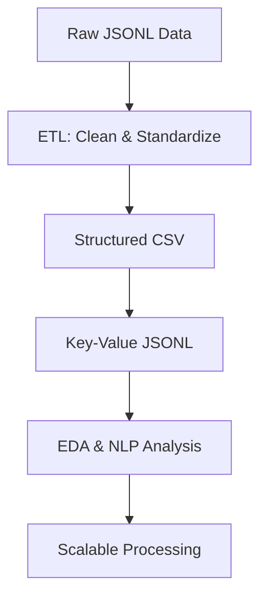

# 📰 Essence News Dataset Analysis

Welcome to the **Essence News Dataset Analysis** project! This repository demonstrates a complete data science workflow for processing, analyzing, and extracting insights from a large-scale news dataset. The work is implemented in the Jupyter notebook [`news_analysis.ipynb`](news_analysis.ipynb).

---

## 📂 Project Structure

- `dataset/News_Category_Dataset_v3.json` — Raw news dataset (JSON Lines format)
- `etl_output.csv` — Cleaned, structured CSV after ETL
- `structured_output.jsonl` — Key–value formatted news data (JSON Lines)
- `news_analysis.ipynb` — Main analysis notebook

---

## 🚦 Step-by-Step Workflow

### 1. **ETL Pipeline**

**Goal:** Extract, clean, and standardize the raw news data for analysis.

#### **Key Operations:**
- **Load** the dataset from JSONL (`dataset/News_Category_Dataset_v3.json`).
- **Extract** relevant fields: `headline`, `short_description`, `category`, `link`, `authors`, `date`.
- **Clean & Standardize**:
  - Remove duplicates and nulls
  - Lowercase and strip text
  - Remove unwanted special characters
- **Export** the cleaned data to [`etl_output.csv`](etl_output.csv).

**Sample Data:**
```json
{"link": "https://www.huffpost.com/entry/covid-boosters-uptake-us_n_632d719ee4b087fae6feaac9", "headline": "Over 4 Million Americans Roll Up Sleeves For Omicron-Targeted COVID Boosters", "category": "U.S. NEWS", "short_description": "Health experts said it is too early to predict whether demand would match up with the 171 million doses of the new boosters the U.S. ordered for the fall.", "authors": "Carla K. Johnson, AP", "date": "2022-09-23"}
```

---

### 2. **Structured Key–Value Pair Formatting**

**Goal:** Transform each news article into a structured dictionary for downstream ML/NLP tasks.

#### **Key Operations:**
- **Read** the cleaned CSV (`etl_output.csv`).
- **Convert** each row to a nested dictionary:
  ```json
  {
    "headline": "...",
    "category": "...",
    "metadata": {
      "description": "...",
      "authors": "...",
      "date": "...",
      "link": "..."
    }
  }
  ```
- **Write** each dictionary as a line in [`structured_output.jsonl`](structured_output.jsonl).

**Example Entry:**
```json
{"category": "u.s. news", "headline": "over 4 million americans roll up sleeves for omicrontargeted covid boosters", "metadata": {"authors": "carla k. johnson, ap", "date": "2022-09-23", "description": "health experts said it is too early to predict whether demand would match up with the 171 million doses of the new boosters the u.s. ordered for the fall.", "link": "https://www.huffpost.com/entry/covid-boosters-uptake-us_n_632d719ee4b087fae6feaac9"}}
```

---

### 3. **Exploratory Data Analysis (EDA)**

**Goal:** Uncover patterns and insights in the news data.

#### **Key Operations:**
- **Category Frequency:**
  - Visualize the top 10 news categories.
- **Text Length Distributions:**
  - Analyze word counts for headlines and descriptions.
- **Missing Value Analysis:**
  - Assess data completeness for key fields.
- **Author Contributions:**
  - Pie chart of top contributing authors.

**Key Insights:**
- Headlines are concise; descriptions are typically 10–40 words.
- Most fields are nearly complete; some missing author data.
- Certain categories and authors dominate the dataset.

---

### 4. **Semantic Text Analysis (NLP)**

**Goal:** Extract deeper meaning and structure from news descriptions.

#### **Key Operations:**
- **Sentiment Analysis:**
  - Use TextBlob to compute polarity and subjectivity.
- **Named Entity Recognition (NER):**
  - Use spaCy to extract organizations, people, and places.
- **Keyword Extraction:**
  - Use TF-IDF to find top unigrams/bigrams.
- **Topic Modeling:**
  - Use LDA to discover main themes in the news.

**Sample Results:**
- **Top Entities:**
  - ORGs: `GOP`, `Senate`, `Congress`, ...
  - PERSONs: `Donald Trump`, `Joe Biden`, ...
  - PLACEs: `U.S.`, `New York`, ...
- **Top Keywords:**
  - `new`, `just`, `people`, `time`, ...
- **LDA Topics:**
  - Health, politics, world events, etc.

---

### 5. **Scaling Strategies for Large Datasets**

**Goal:** Make the pipeline robust for millions of records.

#### **Key Operations:**
- **Streaming & Chunk Processing:**
  - Use pandas `read_csv(chunksize=...)` or process JSONL line-by-line.
- **Modularization:**
  - Encapsulate ETL/NLP steps in classes and functions.
- **Caching:**
  - Store intermediate results to disk for resumable processing.

#### **Code Example:**
```python
def process_csv_in_chunks(csv_path, chunk_size=10000):
    for chunk in pd.read_csv(csv_path, chunksize=chunk_size):
        cleaned_chunk = clean_chunk(chunk)
        yield cleaned_chunk
```

#### **Pipeline Diagram:**


---

## 📈 Summary

- **End-to-end workflow**: From raw data to advanced NLP insights
- **Reusable pipeline**: Modular, scalable, and ready for large datasets
- **Rich analysis**: EDA, sentiment, NER, keywords, and topic modeling

---

## 📚 References

- [Jupyter Notebook: Main Analysis](news_analysis.ipynb)
- [HuffPost News Dataset](https://www.kaggle.com/datasets/rmisra/news-category-dataset)
- [pandas Documentation](https://pandas.pydata.org/)
- [spaCy Documentation](https://spacy.io/)
- [TextBlob Documentation](https://textblob.readthedocs.io/en/dev/)
- [scikit-learn Documentation](https://scikit-learn.org/stable/)

---

## 🏷️ Author

**Waleed Arif** — Data Scientist Assessment 